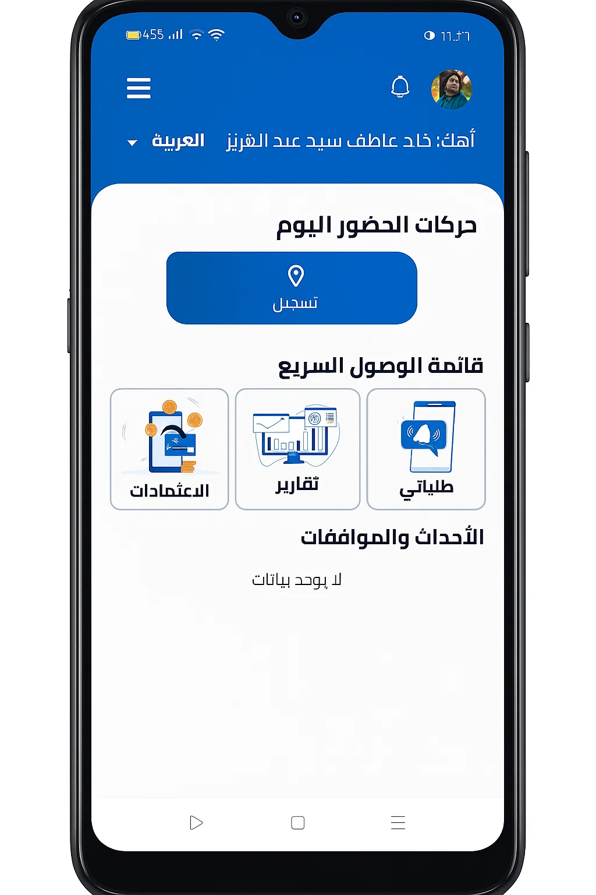
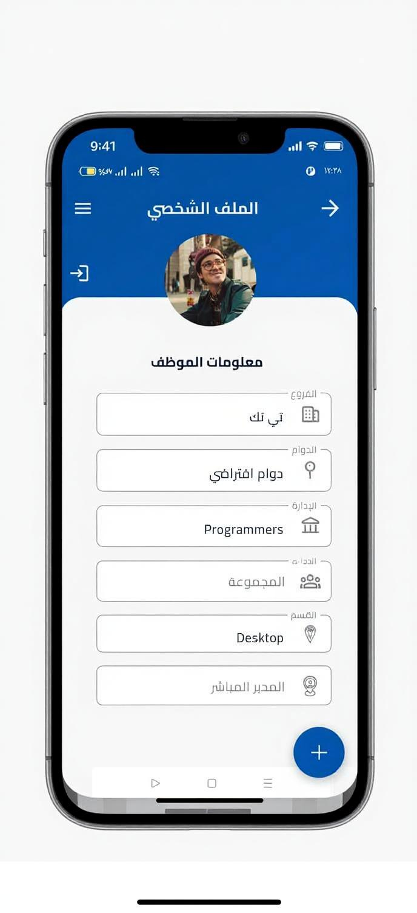

# 👋 Hi, I'm Abdelgawad — Flutter Developer

I'm a passionate Flutter developer with hands-on experience in building real-world mobile apps using **Flutter**, **Dart**, and **Firebase**. I specialize in crafting clean UIs, managing complex state, and delivering smooth, responsive user experiences.

---

## 🚀 My Tech Stack

- 💙 Flutter / Dart
- 🔥 Firebase (Auth, Firestore, Cloud Messaging)
- 🌐 REST APIs, Dio
- 🎯 Riverpod, Bloc, GetX
- 📲 Push Notifications, Google Maps, Clean Architecture
- ⚒️ Git, GitHub Actions, CI/CD

---

## 📱 Featured Projects

### 📌 Apex Time
**Smart Attendance & HR App**  
A mobile solution for employee check-in/out, approvals, and reporting.

- 🔐 Secure attendance with real-time sync
- 📊 Daily, monthly, and department-level reports
- ✅ Request & approve permissions and vacations
- 🔔 Push notifications and alerts

> Tech Used: Flutter, Riverpod, Firebase Auth, Firestore, Dio

---

### ⚽ SPARK — Youth Center App
**Booking & Tournament Management App**

- 📅 Reserve football fields
- 🏆 Manage youth tournaments & teams
- 📍 Integrated Google Maps for locations
- 👥 Admin panel and user roles

> Tech Used: Flutter, Firebase, Firestore, Google Maps API

---

## 📸 Portfolio Showcase

Here are some visuals from my recent work:

---

## 📬 Let's Connect

- 🌐 [LinkedIn](https://www.linkedin.com/in/abdelgawad-hamdy-180a32b9)
- 📧 Email: abdelgawadhamdy2015@gmail.com
- 📁 GitHub: https://github.com/abdelgawadhamdy2015

---

_Thanks for visiting my portfolio!_
